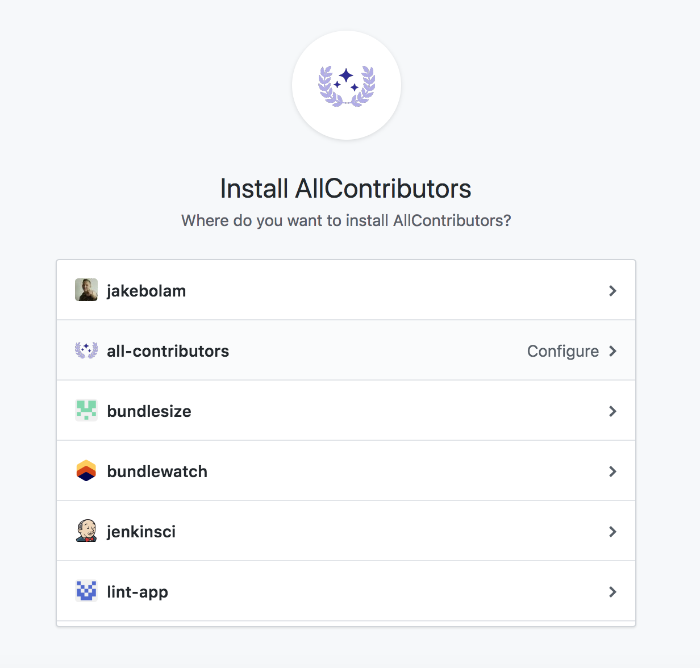
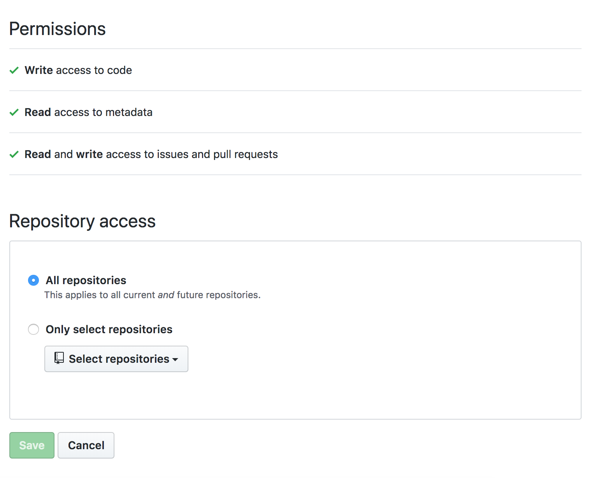

## 1. Install the AllContributors GitHub App
[Install the GitHub App](https://github.com/apps/allcontributors/installations/new)

## 2. Configure your repositories

## 3. Create a `README.md`
Ensure you have a `README.md` file in the root of the project (it can be empty).

If you prefer your contributors table elsewhere than the `README.md`; After merging your first bot PR, you can move your contributors table,
see `files` in the [bot configuration](/docs/bot/configuration)

## Whats Next
- [Using the Bot](/docs/bot/usage)
- [Configuring the Bot](/docs/bot/configuration)

